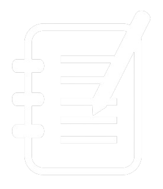

# MyNotes: A Flutter Note-Taking App 

<a href="https://thebatman70.github.io/mynotes">View Screenshots</a>

## Overview

**MyNotes** is a full-stack Flutter project designed to simplify note-taking and organization. Whether you're a student, professional, or creative thinker, MyNotes provides a seamless experience for capturing your thoughts, ideas, and reminders.

## Key Features

1. **State Management with Bloc Pattern and Provider**:
   - Efficiently manage app state using the **Bloc pattern**.
   - Utilize the **Provider package** for localized state management within individual pages.
   - Keep your UI responsive and data-driven.

2. **Authentication Made Easy**:
   - Seamlessly authenticate users with multiple providers:
     - **Email and Password**: Traditional sign-up and login.
     - **Google Sign-In**: Authenticate via Google accounts.
     - **Anonymous Authentication**: No account? No problem!
   - Custom logic for **automatic verification checks** during sign-up.

3. **Note-Taking Functionality**:
   - Create, edit, and delete notes effortlessly.
   - View your notes in a clean and organized interface.
   - Enjoy a smooth user experience with intuitive interactions.

4. **Local Storage with SQLite**:
   - Store your notes locally using **SQLite**.
   - Even when offline, your data remains accessible and secure.

